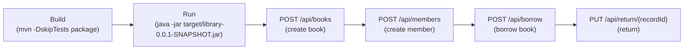

# LAB3-4_REST-API
ตั้งใจทำกันหน่อยครับน้องๆ

## วิธีรันโปรเจค

1. ติดตั้ง Java 17+ และ Maven
2. เข้าไปที่โฟลเดอร์ `bkwcw-spring_labs/library`
3. รันคำสั่ง build:

```bash
mvn -DskipTests package
```

4. รันแอป (ตัวอย่าง):

```bash
java -jar target/library-0.0.1-SNAPSHOT.jar
```

แอปจะรันที่พอร์ต `8080` (ค่าเริ่มต้น)

## ตัวอย่าง API และคำสั่งทดสอบ (curl)

ฐาน URL: `http://localhost:8080/api`

- สร้าง Book (POST /api/books)

```bash
curl -s -X POST http://localhost:8080/api/books \
	-H 'Content-Type: application/json' \
	-d '{"title":"Clean Code","author":"Robert C. Martin","publicationYear":2008,"genre":"Programming","availableCopies":3}'
```

- สร้าง Member (POST /api/members)

```bash
curl -s -X POST http://localhost:8080/api/members \
	-H 'Content-Type: application/json' \
	-d '{"name":"Somchai","email":"somchai@example.com","phoneNumber":"0812345678","startDate":"2026-01-01","endDate":"2027-01-01"}'
```

- ยืมหนังสือ (POST /api/borrow) — ต้องมี `book.id` และ `member.id` ที่มีอยู่แล้ว

```bash
curl -s -X POST http://localhost:8080/api/borrow \
	-H 'Content-Type: application/json' \
	-d '{"book":{"id":1},"member":{"id":1}}'
```

- คืนหนังสือ (PUT /api/return/{recordId})

```bash
curl -s -X PUT http://localhost:8080/api/return/1
```

## Postman collection (ตัวอย่าง)

ไฟล์ตัวอย่าง Postman collection อยู่ที่ `postman/Library.postman_collection.json` ใน repo นี้ — นำเข้าใน Postman แล้วรันตามลำดับ:

- Create Book
- Create Member
# LAB3 REST API — Quick Start (ภาษาไทย)

ภาพรวม
- โปรเจกต์ตัวอย่างสำหรับ Lab3: มีตัวอย่าง Spring Boot app ชื่อ `library` (จัดเก็บข้อมูลในหน่วยความจำ, List<T>) และตัวอย่าง `jobportal` ที่เป็นส่วนประกอบของ repo
- สาขาที่ใช้งาน: `LAB3` — โค้ดปรับให้เป็นไปตามข้อกำหนด Lab 3 (no JPA, service contains business logic)

Prerequisites
- Java 21
- Maven (`mvn`) หรือใช้ `./mvnw` ถ้า wrapper ทำงาน

Build & Run (library)
1. เปิดเทอร์มินัลและไปที่โฟลเดอร์ library:

```bash
cd Lab3-4_Rest-API/bkwcw-spring_labs/library
```

2. สร้างไฟล์ jar (ข้ามการทดสอบเพื่อความรวดเร็ว):

```bash
mvn -DskipTests package
```

3. รันแอป (ตัวอย่าง รันเป็นแบ็กกราวด์และเขียน log ลง `library.log`):

```bash
nohup java -jar target/library-0.0.1-SNAPSHOT.jar > library.log 2>&1 &
tail -f library.log
```

ค่าปกติ: แอป `library` ฟังบนพอร์ต `8080` และฐาน URL ของ API คือ `http://localhost:8080/api`.

สำคัญ: ข้อมูลจะเก็บในหน่วยความจำเท่านั้น — รีสตาร์ทแล้วข้อมูลจะหาย

API ตัวอย่าง
- GET `/api/books` — ดึงรายการหนังสือทั้งหมด
- GET `/api/books/{id}` — ดึงหนังสือตาม id
- POST `/api/books` — สร้างหนังสือใหม่
- PUT `/api/books/{id}` — อัพเดตหนังสือ
- DELETE `/api/books/{id}` — ลบหนังสือ

- POST `/api/members` , GET `/api/members`, PUT `/api/members/{id}`, DELETE `/api/members/{id}`

- POST `/api/borrow` — ยืมหนังสือ (รับทั้งรูปแบบ `{ "bookId":1, "memberId":1 }` หรือ nested object)
- PUT `/api/return/{recordId}` — คืนหนังสือ

ตัวอย่างคำสั่ง (curl)

สร้างหนังสือ:

```bash
curl -X POST -H "Content-Type: application/json" \
	-d '{"title":"Clean Code","author":"Robert C. Martin","publicationYear":2008,"genre":"Programming","availableCopies":3}' \
	http://localhost:8080/api/books
```

สร้างสมาชิก:

```bash
curl -X POST -H "Content-Type: application/json" \
	-d '{"name":"Alice","email":"alice@example.com"}' \
	http://localhost:8080/api/members
```

ยืมหนังสือ (โดยใช้ IDs):

```bash
curl -X POST -H "Content-Type: application/json" \
	-d '{"bookId":1,"memberId":1}' \
	http://localhost:8080/api/borrow
```

คืนหนังสือ:

```bash
curl -X PUT http://localhost:8080/api/return/1
```

Postman
- นำเข้าไฟล์: `Lab3-4_Rest-API/bkwcw-spring_labs/library/postman/Library.postman_collection.json`

Troubleshooting
- หากพอร์ต 8080 ถูกใช้งาน ให้หยุดโปรเซสหรือแก้ไฟล์ `application.properties` ใน `src/main/resources`
- หาก `mvnw` ใช้งานไม่ได้ ให้ใช้ `mvn` ที่ติดตั้งบนเครื่อง
- ข้อมูลทั้งหมดถูกเก็บในหน่วยความจำ — รีสตาร์ทจะล้างข้อมูล

เพิ่มเติมที่ผมช่วยได้
- เพิ่มรายละเอียด endpoint (ตัวอย่าง response, ฟิลด์ที่จำเป็น) — บอกผมได้เลย
- สร้างสคริปต์ตัวอย่างสำหรับรันครบ flow (create book/member, borrow, return)

## Workflow (ภาพรวมการทำงาน)

แผนภาพด้านล่างแสดงลำดับการทำงานตั้งแต่ build → run → ตัวอย่าง flow ของ API (create book → create member → borrow → return).



ถ้าแพลตฟอร์มไม่รองรับ Mermaid ให้ดู ASCII fallback ด้านล่าง:

Build -> Run -> POST /api/books -> POST /api/members -> POST /api/borrow -> PUT /api/return/{id}

ตัวอย่างคำสั่งแบบลำดับ (สรุป):

```bash
# 1) build
mvn -DskipTests package

# 2) run
nohup java -jar target/library-0.0.1-SNAPSHOT.jar > library.log 2>&1 &

# 3) create book
curl -X POST -H "Content-Type: application/json" -d '{"title":"Clean Code","author":"Robert C. Martin","publicationYear":2008,"genre":"Programming","availableCopies":3}' http://localhost:8080/api/books

# 4) create member
curl -X POST -H "Content-Type: application/json" -d '{"name":"Alice","email":"alice@example.com"}' http://localhost:8080/api/members

# 5) borrow
curl -X POST -H "Content-Type: application/json" -d '{"bookId":1,"memberId":1}' http://localhost:8080/api/borrow

# 6) return
curl -X PUT http://localhost:8080/api/return/1
```

